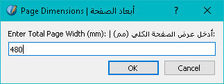

# Scribus Tiling/Ganging Script Documentation

## 💡 Short Description

The **Scribus Tiling/Ganging Script** is a utility for Scribus that automates the imposition process known as **ganging** or **step-and-repeat tiling**. Its primary function is to take multiple individual **image files of uniform dimensions** and arrange them efficiently onto a single, standard print sheet (e.g., A4 or A3). Crucially, the script automatically generates a dedicated, precision **Cut Path** (a hidden vector layer) over each ganged item. This allows the final exported PDF or EPS file to be used directly for accurate contour cutting on a plotter or digital cutter, significantly streamlining the **print-and-cut** production workflow.

---

## 📝 Detailed Description and Explanation

### Purpose and Workflow

The script arranges multiple images with the same dimension on one sheet for printing them all on the larger sheet and taking advantage of the large paper size in Press Machines, and also it adds polygon on each image to allow for Print and Cut or Cutter Plotters to cut the images from the larger sheet.

1.  **Input:** The workflow begins with a folder containing numerous unique **image files** (PNG, TIFF, JPEG, etc.). **These images must all share the same fixed dimensions** (e.g., 90mm x 50mm). These represent the finished artwork for each individual item you need to print and cut.
2.  **Ganging:** The script takes this folder of individual image files and arranges them on a document page based on user-defined page and item dimensions. This process of arranging **uniform-sized items** is called **ganging** or **step-and-repeat tiling**, which maximizes media utilization by packing the items with precise, zero or minimal gap spacing.
3.  **Cut Path Automation:** For accurate contour cutting, the script automatically places a transparent, vector **Cut Path** (a rectangle) over the exact boundaries of every item. This vector layer is the key component recognized by most professional cutting software (like those used with Mimaki, Summa, or Graphtec plotters) for precise finishing.
4.  **Output:** The final output is a single Scribus document ready for export as a standard industry file type, such as **PDF/X-3** or **EPS**, which contains both the printable images and the hidden, vector cut paths.

### Key Features Summary

| Feature | Technical Explanation |
| :--- | :--- |
| **Input Requirement** | Designed specifically for input folders containing individual **image files of uniform dimensions** (fixed width and height). |
| **Precision Ganging** | Implements a **step-and-repeat** imposition to fill the sheet based on page and frame dimensions, optimizing material use with user-defined horizontal and vertical spacing. |
| **Vector Cut Path Generation** | Automatically creates a dedicated, transparent vector object (**no fill** / **no stroke**) layer over each item, ensuring that the necessary vector data for cutting is embedded in the final output file. |
| **Separation of Layers** | The generated output cleanly separates the printable artwork (raster images) from the necessary cutting data (hidden vectors). |
| **Industry Standard Output** | Ensures the final file is exportable to robust formats (**PDF/X-3**, **EPS**) required by professional cutting and RIP (Raster Image Processor) software. |

*Description: A prominent screenshot showing the final Scribus page layout, visually demonstrating multiple ganged items on a single sheet, with clear indicators (e.g., dashed lines for cut paths if visible or implied) of the script's output.*

---

## 🛠️ How to Install and Use

### 1\. Installation

1.  **Download the Script:** Obtain the script file from its reposetory here on github (`scribus_tiling_ganging_script.py`).
2.  **Store the script:** Copy the script in a place you want on your hard drives.
3.  **Run The Script:** Run Scribus and close the Create New File dialog, then open Script Menu and choose Execute Script, now navigate to where your copy of the script file is, and Open it.
4.  **To re-run the script again:** Just head to Script menu and you will find the script under Recent Scripts.

### 2\. Usage (General Workflow)

This procedure starts once you have a folder of final, individual image files ready for ganging. **Remember: all input images must have the same physical dimensions.**

1.  **Prepare Input Folder:** Ensure all items you want to gang are located in a single folder (e.g., `Generated Cards`).
2.  **Prepare Scribus:** Open Scribus (you don't need a specific document open, but ensure any complex design documents are closed).
3.  **Execute Script:** From **Script** menu \> **Execute Script** and Navigate to **scribus_tiling_ganging_script.py**.

*Description: A screenshot of the Scribus menu, highlighting "Scripting" then "Execute Script", and finally showing the "Tiling/Ganging Script" selected in the file dialog.*

4.  **Input Parameters (Dialog 1,2, 3, 4 & 5):**
    * **Image Path:** Select the folder containing your individual image files (e.g., `Generated Cards`).
    * **Page Dimensions:** Enter the dimensions of your physical print media in millimeters (e.g., **210mm x 297mm**).
    * **Frame Dimensions:** Enter the exact dimensions of the individual item being ganged in millimeters (e.g., **90mm x 50mm**).

*Description: A screenshot of the Tiling/Ganging Script's first input dialog, fully populated with example values for Image Path, Page Dimensions, and Frame Dimensions.*

5.  **Spacing Parameters (Dialogs 4 & 5):**
    * Enter the required value in millimeters (**mm**) for the **Horizontal Gap Between Frames** and the **Vertical Gap Between Frames**. Use **0** for a full bleed, zero-gap ganging setup.

*Description: Screenshots of the two dialog boxes asking for the Horizontal Gap and Vertical Gap, showing the user entering '0' or a specific spacing value.*

6.  **Generation:** The script will automatically create a new Scribus document, arrange all images onto the page, and apply the necessary hidden vector cut paths.

*Description: A prominent screenshot showing the final Scribus page layout, visually demonstrating multiple ganged items on a single sheet, with clear indicators (e.g., dashed lines for cut paths if visible or implied) of the script's output.*

***

***Tested on Scribus 1.6.3***

### 3\. Practical Example: Using ScribusGenerator for Input Images (Optional)

This procedure demonstrates one method for generating the required input images of **uniform dimensions** using **ScribusGenerator**.

#### 1\. ScribusGenerator Download

If you don't have it already, download the ScribusGenerator script from this address: **[https://berteh.github.io/ScribusGenerator/](https://berteh.github.io/ScribusGenerator/)**. Place this script in a directory where you want to store it.

#### 2\. Input Image Generation

1.  **Data File & Design Preparation:**
      * Prepare a structured spreadsheet file using any spreadsheet creator like LibreOffice Calc, The file should contain a column for Employee Name that you will give the first cell of it a specific text, say "employee_name" without the quotation, then make another column for Job Title and fill the first cell with, say "job_position" without the quotation. Fill the 2 columns with your data of names and job titles then save the document as (**csv**) with (**Unicode (utf-8)**) selected for encoding, I saved mine as "employee_data.csv".
      * Create a Scribus document with the item's dimensions (e.g., **90mm x 50mm**).
      * Insert text holder into Text Frames using the **%VAR_%** symbol (e.g., `%VAR_employee_name%` and %VAR_job_position%).

2.  **Run ScribusGenerator:**
      * **Script** \> **Execute Script** and navigate to where you stored **ScribusGenerator**.
      * Select scribus file and the spreadsheet file and specify the **Output Directory** (`Generated Cards`).
      * Select **Output Type: Image** and choose the required output format (**PNG** or **TIFF**).
      * Click **Generate**.

*Description: A screenshot of the ScribusGenerator dialog box showing the selected CSV file, the output directory, and the "Output Type: Image" setting selected, specific to the example context.*

3.  **Proceed to Usage (General Workflow):** Use the newly created `Generated Cards` folder as the **Image Path** input when running the **Tiling/Ganging Script**.

### 4\. Final Output and Export

1.  **Review:** Inspect the generated Scribus document to confirm the tiling layout is correct.

*Description: A screenshot of the final Scribus document displaying the ganged layout, similar to the main showcase image but with specific example content.*

2.  **Export:** Export the final document as a **PDF/X-3** or **EPS** file. These formats preserve the hidden vector cut path data alongside the printable image data.

3.  **Cut:** Load the exported file into your cutter plotter software. The software should interpret the embedded vector data for **precise contour cutting** of the printed items.

---

## 🔑 Keywords

**Imposition, Ganging, Tiling, Step-and-Repeat, Uniform Dimensions, Cut Path, Contour Cut, Cutter Plotter, Scribus Script, Print-and-Cut, PDF/X-3, EPS, ScribusGenerator.**

---

### 📌 Attribution for Design Used in Example

**[Business card template](https://all-free-download.com/free-vector/download/business_cards_templates_elegant_dynamic_curves_decor_6919515.html)** used for explanation is by **[All-free-download.com](https://all-free-download.com)**, and is licensed under **[CC BY-ND](https://creativecommons.org/licenses/by-nd/4.0/)**.